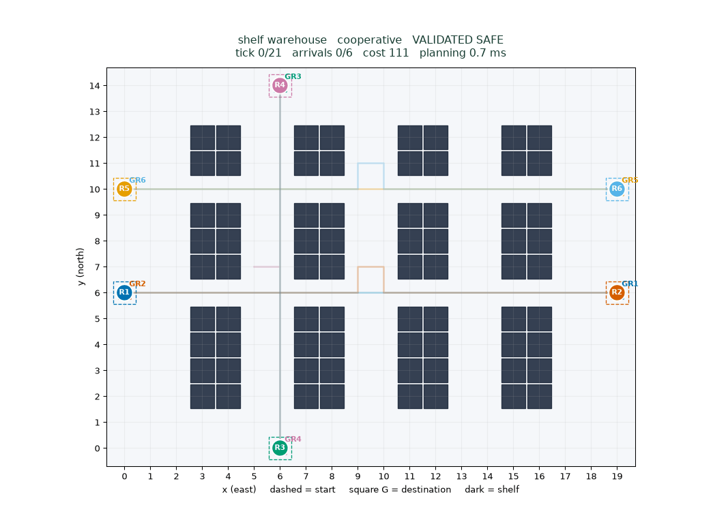
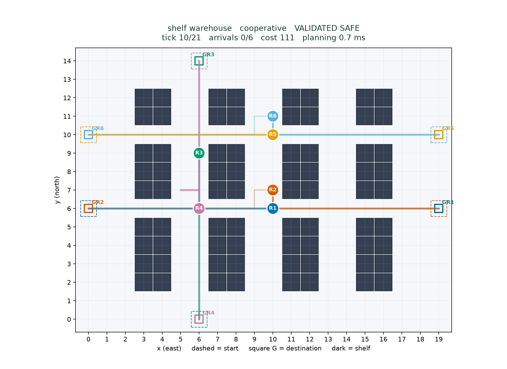
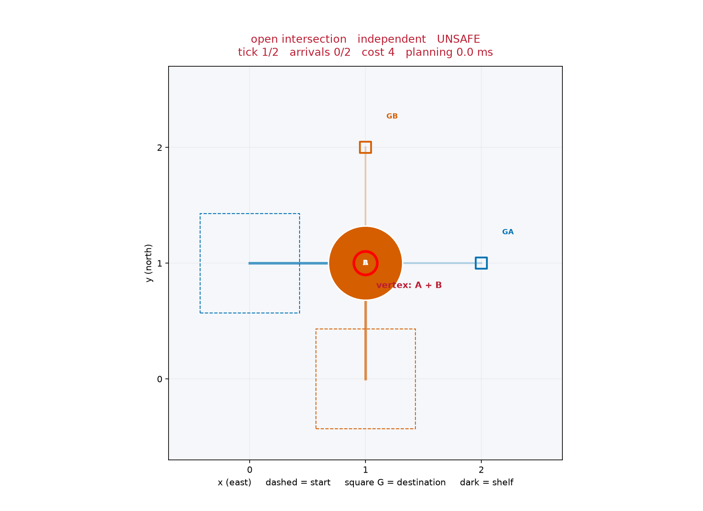
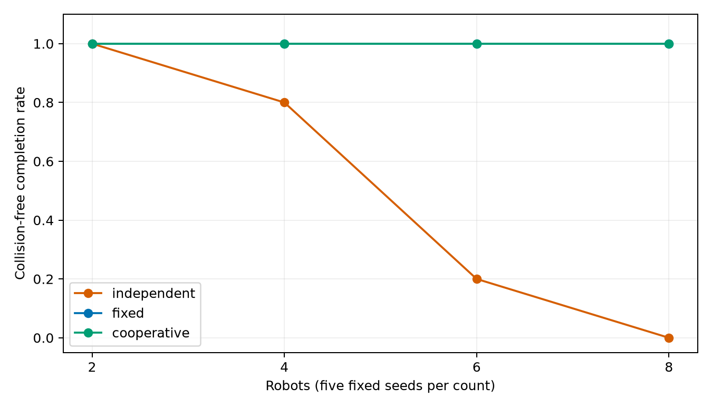

# Warehouse Robot Coordination with A* Search

Student: **Shiveshwar Kumar Sah**

Roll number: **BL.EN.U4CSE23072**

A Fundamentals of AI case study on planning a single delivery wave for multiple
robots in a warehouse. The project compares independent A* routes with two
prioritized space-time A* planners, then checks their paths for collisions before
replaying them together.

The default map has **20 × 15 cells and six robots**. Search is implemented from
scratch using Python's `heapq`; Matplotlib is used only for the simulation and
plots. The application runs locally without an API, account, GPU, or internet
connection once its dependencies are installed.



## What the project demonstrates

A shortest route for each robot does not necessarily produce a safe joint plan.
Two robots may reach the same cell at the same time, or swap places along an edge.
The coordinator adds time to the search state and reserves previously planned
routes. Waiting is a search action, not a delay added after planning.

- **Independent A*** plans each route without considering other robots. Conflicting
  results are explicitly marked unsafe.
- **Fixed-priority planning** uses space-time A* in lexicographic robot ID order.
- **Priority-portfolio planning** tries a distance-based order, its reverse, and
  seeded permutations. It returns the first independently validated complete plan.

An independent validator checks bounds, shelves, legal movements, shared cells,
opposite-edge swaps, and occupancy after shorter paths finish.

## Getting started

Use Python **3.11 or newer**. The project was tested locally with Python 3.12.14.

```bash
git clone https://github.com/shiv-eshwar/FAI-case-study.git
cd FAI-case-study
```

On macOS or Linux:

```bash
python3.12 -m venv .venv
source .venv/bin/activate
python -m pip install -e '.[test]'
```

An available `python3` version ≥ 3.11 can replace `python3.12`.

On Windows PowerShell:

```powershell
py -3.12 -m venv .venv
.\.venv\Scripts\Activate.ps1
python -m pip install -e ".[test]"
```

If PowerShell blocks activation, use `.\.venv\Scripts\python.exe` in place of
`python`. Windows instructions are provided, but local GUI verification was on
macOS.

### Run the simulation

```bash
python -m warehouse_ai demo --scenario configs/default.json
```

The window provides Play/Pause, Step, Reset, a playback-speed slider, and a
paths/trails toggle. It shows the current tick, arrivals, cost, makespan, planning
time, and safety status. Each tick updates all robot positions simultaneously.



Dashed boxes mark starts, squares mark destinations, and dark cells are shelves.
Robot IDs and destination labels use stable colors.

### Show why independent routes are unsafe

```bash
python -m warehouse_ai demo --scenario configs/intersection.json --algorithm independent --output results/unsafe_demo.json
```



In this small intersection, both independent routes pass through the center at
tick 1. With coordination, one robot waits before crossing:

```bash
python -m warehouse_ai demo --scenario configs/intersection.json --algorithm cooperative --output results/intersection_demo.json
```

## Commands

Run these from the repository root after installation:

```bash
# Plan without opening a window
python -m warehouse_ai plan --scenario configs/default.json --algorithm cooperative --seed 42

# Replay the saved plan
python -m warehouse_ai replay --plan results/default_plan.json

# Render without a GUI
python -m warehouse_ai render --plan results/default_plan.json --output assets/demo.gif
python -m warehouse_ai render --plan results/default_plan.json --output build/frame.png --tick 10

# Run the tests
python -m pytest -q

# Repeat the benchmark without overwriting the bundled results
python -m warehouse_ai benchmark --config configs/benchmark.json --output build/benchmark
```

`render` uses the headless Agg backend. Only `demo` and `replay` need a GUI backend.
Scenario and plan paths can also be absolute, so commands can run from another
directory. Without `--output`, benchmark output is resolved relative to its
configuration file.

Use `--algorithm independent`, `fixed`, or `cooperative` to compare planners.
The defaults are `--horizons 40 80 --limit 30000 --permutations 3`. Every failed
priority attempt gets a fresh reservation table, and its work counts toward the
total planning effort.

| Configuration | Purpose |
| --- | --- |
| `configs/default.json` | Six-robot shelf warehouse |
| `configs/intersection.json` | Crossing routes that require coordination |
| `configs/bottleneck.json` | Passing-bay limitation case |
| `configs/order_sensitive.json` | Different outcomes under different priorities |
| `configs/impossible.json` | Bounded failure in a corridor without a bypass |
| `configs/disconnected.json` | Statically unreachable destination |

## Movement and safety rules

- Coordinates are `(x, y)`, with the origin at the lower left. East increases `x`
  and north increases `y`; an equivalent array would use `[y, x]`.
- A robot moves north, south, east, west, or waits. Each action costs one tick.
- Starts are distinct, goals are distinct, and every endpoint is traversable.
- Robots occupy their starts at tick 0 and stay at accepted terminal goals
  indefinitely. A goal visit is not accepted as terminal if future reservations
  would prevent the robot from remaining there.
- Sharing a cell at a tick and traversing an edge in opposite directions during
  the same interval are forbidden. Following into a cell another robot just left
  is allowed.
- Shelves are static. Robots are point agents, and planning is centralized and
  completed before playback.

## Recorded results

The bundled experiment contains **78 solver runs**: 60 aggregate runs across
20 shared instances, plus 18 runs across six diagnostic scenarios. Aggregate
instances use 2, 4, 6, and 8 robots with five fixed seeds per count.

| Planner | Safe completions across 20 aggregate instances |
| --- | ---: |
| Independent A* | 10 / 20 |
| Fixed-priority space-time A* | 20 / 20 |
| Priority-portfolio space-time A* | 20 / 20 |



The saved default coordinated plan has a sum of costs of **111**, a makespan of
**21 ticks**, **110 moves**, **one wait**, and **zero detected conflicts**.

The portfolio is not always cheaper: for the five six-robot instances, its mean
cost was 77.8 compared with 75.4 for fixed priority, while its mean makespan was
slightly lower. Both planners also fail the passing-bay diagnostic despite a
valid joint-plan witness checked by the tests. These results show why priority
retries should not be described as complete or globally optimal.

Costs and makespans are averaged only over valid plans; failures are retained,
not assigned zero cost. Sum of costs counts actions before terminal arrival,
including waits but excluding display padding. Conflict counts use an unordered
robot pair per vertex tick or edge-swap interval through the joint makespan.
Planning timing excludes rendering and depends on the machine.

Raw records, summaries, heuristic comparisons, limits, seeds, and dependency
versions are in [`results/`](results/).

## Tests

The recorded local suite passed **22 tests**, including after extracting the
submission archive into a separate directory. It covers:

- A* and zero-heuristic costs against an independent BFS oracle on 50 seeded maps.
- Path reconstruction, invalid inputs, blocked endpoints, and disconnected maps.
- Waiting, reservation time indexing, reverse-edge rejection, future goal visits,
  and permanent goal occupancy.
- Vertex conflicts, edge swaps, allowed following moves, and corrupted paths.
- Priority sensitivity, clean retries, deterministic seeds, and bounded failures.
- CLI execution from another directory, JSON replay, and real PNG/GIF exports.

Captured output is in [`results/test_execution.txt`](results/test_execution.txt)
and [`results/extracted_test_execution.txt`](results/extracted_test_execution.txt).
GitHub Actions reruns the suite on pushes and pull requests.

## Repository layout

```text
src/warehouse_ai/   Search, reservations, coordination, validation, and replay
configs/           Warehouse layouts and benchmark configuration
tests/             Algorithm, safety, CLI, and rendering tests
scripts/           Scenario, artifact, verification, and packaging scripts
results/           Saved plans, raw measurements, summaries, and test evidence
assets/            Simulation GIF, screenshots, and measured plots
docs/              Report, viva guide, demo script, and code walkthrough
slides/            Editable presentation and PDF preview
```

Start with the [code walkthrough](docs/code_walkthrough.md) to follow the main
data flow. The [demo script](docs/demo_script.md) gives a 3–4 minute demonstration,
and the [viva guide](docs/viva_guide.md) explains the design decisions.

### Submission documents

- Report: [PDF](docs/report.pdf) · [Editable Word document](docs/report.docx)
- Presentation: [PowerPoint](slides/presentation.pptx) · [PDF preview](slides/presentation.pdf)
- [Verified references](docs/references.md)
- [Verification record and environment notes](docs/QA.md)

The report has 15 pages and the presentation has 15 slides with speaker notes.
Both were rendered and visually reviewed. The student name and roll number are
filled in; complete the institution, faculty, and submission date before submitting.

## Regenerating the documents

```bash
python -m pip install -e '.[test,documents]'
python scripts/build_artifacts.py
python scripts/render_artifacts.py --soffice /path/to/soffice
python scripts/verify_delivery.py
python scripts/package_submission.py
```

Artifact generation reads the saved experiment data. PDF conversion requires
LibreOffice, and page-image rendering requires Poppler. Neither tool is required
to run the algorithms or simulation. To regenerate the scenarios and experiment
data first, run `python scripts/create_scenarios.py` and
`python -m warehouse_ai benchmark --config configs/benchmark.json`.

## Limitations and development note

Prioritized planning is order-dependent, incomplete, and not globally optimal.
Finite horizons or expansion limits can reject feasible problems. Conflict-Based
Search, dynamic obstacles, continuous task allocation, and physical robot geometry
are not implemented.

AI tools assisted with implementation, testing, and document preparation. Follow
your course's disclosure policy and review the code and results before submission.
