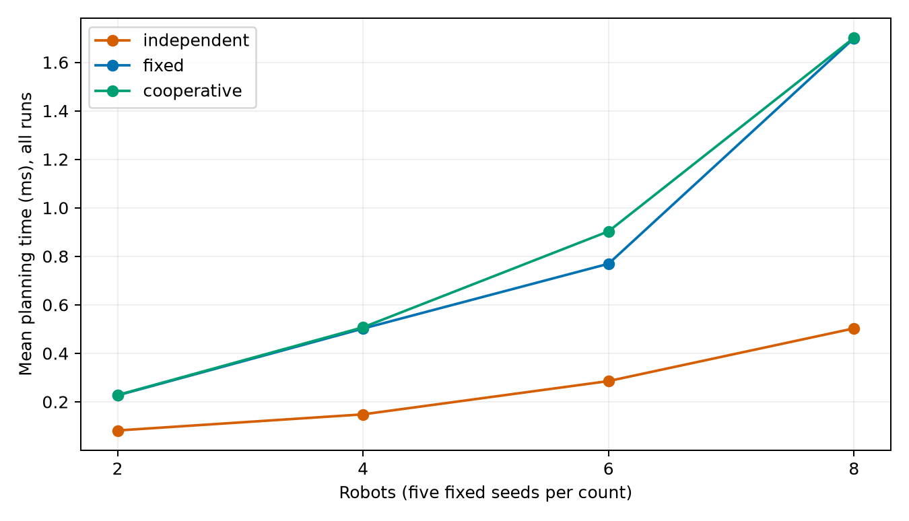
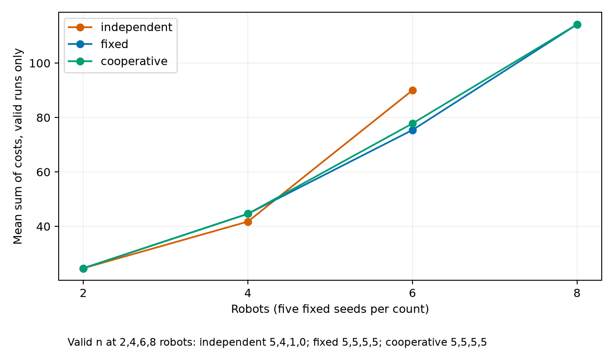
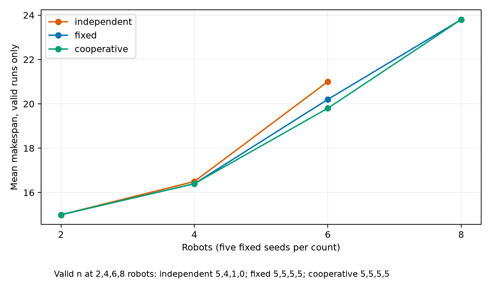

# Multi Agent Warehouse Robot Coordination Using A Star Search

Fundamentals of AI undergraduate case study
[Student Name]   [Roll Number]
[Institution]   [Faculty]   [Submission Date]

Abstract

This case study implements and evaluates robot coordination for a single delivery wave in a static warehouse grid. Spatial A* with Manhattan distance supplies an independent-routing baseline. A centralized coordinator then searches states containing position and time, using vertex reservations, directed edge checks, waiting actions and permanent terminal goal occupancy. Fixed priorities and a bounded portfolio of deterministic priority attempts share the same low-level search. An independent validator inspects legal transitions and simultaneous occupancy before any coordinated plan is accepted. Experiments use a fixed shelf layout, four robot counts and five fixed seeds, together with six diagnostic scenarios. Both coordinators completed all twenty aggregate instances safely, while independent routing was safe on ten. At six robots, portfolio planning had a higher paired mean travel cost than fixed order, illustrating that retries do not globally optimize the objective. The default six-robot plan completes in twenty-one ticks. Automated tests cover an independent BFS oracle, collision semantics, goal occupancy, order sensitivity, bounded failure, JSON replay and headless rendering. Editable artifacts, saved evidence and offline reproduction commands accompany the implementation.

Scope and demonstrated outcome

The implementation covers offline planning and synchronous replay for point robots with static shelves. It excludes task allocation, physical motion control and dynamic replanning. The results support safe execution on the tested instances, with explicit limits on generalization. The marking coverage guide in Section 11 relates the requested 3-mark problem component and 7-mark implementation component to concrete evidence.

# 1 Warehouse problem and formal formulation

Robots carry assigned loads from starting bays to unique dispatch destinations. A shelf blocks a cell permanently. Crossing aisles allow routes to interact, so independent shortest paths are insufficient to ensure a safe delivery wave. The default warehouse has 20 columns, 15 rows and six robots. The geometry is configurable through JSON rather than encoded into the search logic.

Let V be the traversable cells and E connect orthogonally adjacent cells. Each robot i has start s_i and goal g_i. A full joint state at tick t is the tuple of robot positions. The decentralized low-level representation (x,y,t) belongs to the chosen algorithm, not the problem definition. Inputs are grid dimensions, blocked cells, assignments and the collision/occupancy rules.

Coordinates use x eastward and y northward with origin at the bottom left. An array would address a cell as [y,x]. The program instead stores shelves as a set of (x,y) tuples. Robot starts are distinct traversable cells, and goals are distinct traversable cells. A start may equal its own goal or another robot's goal. All robots occupy their starts at tick zero.

Every action advances one global tick and either moves north, south, east, west, or waits in place. Actions cost one. Transition legality requires bounds and shelf clearance, with no teleportation or diagonal moves. Robots are point agents occupying one cell, and there is no continuous geometry or load-dependent speed.

The goal test requires every robot to reach an accepted terminal goal and remain there. An intermediate goal visit can depart if staying would conflict with a future reservation. Only the final suffix completes delivery. The primary objective is a valid plan that completes all deliveries. Travel cost and makespan are reported as performance objectives, without claiming the coordinator minimizes them globally.

Table 1  Hard constraints and modeling assumptions

Constraint | Exact interpretation
Vertex safety | For every pair i,j and tick t, positions differ.
Edge safety | Two robots cannot exchange their distinct cells in one interval.
Following | Entering another robot's just-vacated cell is allowed.
Terminal occupancy | Every final goal remains occupied for all later ticks.

# 2 Spatial A Star and the independent baseline

Spatial A* searches only cells. The priority f is the known path cost g plus heuristic h [1]. Manhattan distance is the sum of the absolute coordinate differences. With four-connected unit moves, one tick can reduce this distance by at most one. Waiting does not reduce it. Shelves can lengthen a route but cannot create a shorter route than this lower bound. Manhattan is therefore admissible and consistent for this model.

The shared search implementation uses heapq, g_score and a parent dictionary. Each heap entry contains f, g, a monotonic insertion counter and the state. Lower g breaks equal-f ties, followed by insertion order. Neighbors follow a fixed order. A popped entry whose g differs from the current best value is stale and is skipped. This prevents an old improvement candidate from doing duplicate work.

Setting h to zero produces Dijkstra's algorithm without duplicating the search. A success path is reconstructed by following parents from the accepted goal to the start. Blocked or invalid endpoints return invalid_input. Spatial heap exhaustion returns static_disconnection, while an expansion cap returns expansion_limit. Start equals goal returns a one-cell path with cost zero.

The independent baseline runs spatial A* for each robot with no inter-robot constraints. The validator then replays the paths simultaneously and pads shorter paths at their goals. A conflicting joint plan is labeled unsafe. Its raw path costs remain informative as individual route lengths, but are not costs of a feasible joint solution.

f(n) = g(n) + h(n)    h(x,y) = |x - goal_x| + |y - goal_y|

```text
SPATIAL A STAR
heap <- (h(start), 0, serial, start)
g_score[start] <- 0
while heap is nonempty:
  pop smallest entry; skip if stale
  stop if expansion limit reached
  count processed pop; accept if goal
  for each legal orthogonal neighbor:
    if g + 1 improves its score:
      set score and parent; push with g + 1 + h
return static disconnection on heap exhaustion
```

The separate five-pair heuristic experiment kept path costs equal. Mean processed pops were 19.4 with Manhattan and 110.8 with h=0. This isolates heuristic search effort, not coordination quality. Full records are in results/heuristic.json.

# 3 Space time search and waiting

Space-time A* augments position with absolute tick t, as in cooperative pathfinding [2]. The root is (start_x,start_y,0). Every successor has time t+1. The spatial neighbor order stays deterministic and a wait successor is appended. A wait has the same unit cost as a move, allowing the algorithm to avoid conflicts by changing arrival times rather than merely changing spatial routes.

Before insertion, each successor checks the destination vertex at tick t+1 and the reverse of its directed traversal during interval t to t+1. A reserved reverse edge forbids an opposite traversal even when the destination is free at the arrival tick. A following action can still be allowed because the destination has been vacated and the reverse edge is absent.

A candidate goal is accepted only when it can remain occupied indefinitely. The search may reach the goal while this test fails and continue searching. A later terminal arrival or a detour can make the route safe. The time-independent Manhattan heuristic remains a lower bound under the additional constraints.

The time horizon is an absolute maximum tick, not a number of extra waits. States at the horizon may be accepted but cannot expand successors. A processed-pop limit bounds work independently. Exhausting the finite state space returns bounded_search_exhausted. This describes a bounded attempt, not proof that every possible coordinated plan is impossible. The coordinator performs spatial preflight to distinguish static disconnection before attempting temporal searches.

```text
SPACE TIME A STAR
root <- (start, 0); use f = elapsed ticks + Manhattan
while frontier is nonempty:
  pop non-stale state; enforce expansion cap
  if position is goal and can_hold(goal, t): reconstruct
  if t == horizon: continue
  for legal move or wait to q:
    reject vertex(q, t+1) reservation
    reject reserved reverse edge(q, p, t)
    relax state(q, t+1) with unit cost
return bounded search exhausted
```

For a fixed set of higher-priority reservations, the low-level search returns a shortest accepted route within the search bounds when it succeeds. This conditional claim says nothing about the global sum of costs: the reservations themselves depend on earlier priority decisions.

# 4 Reservation semantics and checked example

The reservation table has four explicit structures. vertices stores (cell,tick) for every state of a committed route, including tick zero. edges stores (from,to,departure_tick). permanent maps a terminal goal to its arrival tick and blocks it from then onward. last_visit stores the latest finite reserved tick for each cell.

A candidate terminal goal at tick a is safe only if it has no permanent reservation and its latest finite visit is strictly earlier than a. This condition includes conflicts after a short route would otherwise have ended. Merely testing the arrival tick can incorrectly accept a goal that a higher-priority robot visits later.

The following intersection example is generated from the actual fixed-order solver in results/worked_example.json. Independent routes both occupy (1,1) at tick 1. With A reserved first, B waits at (1,0) for one tick, then enters the center after A leaves. At tick 2, A remains at (2,1), and B follows into the vacated center.

Table 2  Validated fixed-order intersection replay

Tick | Robot A | Robot B
0 | (0, 1) | (1, 0)
1 | (1, 1) | (1, 0)
2 | (2, 1) | (1, 1)
3 | (2, 1) | (1, 2)


For the independent edge-swap diagnostic, A moves u to v while B moves v to u in the same interval. Reserving (u,v,t) forces the low-level search to reject (v,u,t). Waiting outside the edge or taking a bypass can resolve a feasible case; a one-cell corridor without a bypass cannot change the ordering of two robots.

# 5 Priorities retries and bounded failure

The fixed mode plans in lexicographic robot ID order, giving a reproducible coordinator baseline. The cooperative mode first sorts by descending Manhattan start-to-goal distance, using robot ID to break ties. It next tries the reverse order and three seeded permutations. Duplicate orders are removed while preserving their first occurrence.

The default horizon schedule is 40 then 80 ticks. For each horizon, every unique order is tried until one complete valid result succeeds. Each attempt receives a newly constructed reservation table and path dictionary. A failed attempt discards all tentative routes. The selection rule is the first validated complete plan, rather than the lowest-cost successful plan.

Total planning time includes static preflight, priority construction, all failed low-level searches and the final validation. Expanded and generated counts include preflight and every attempt. Per-attempt logs record order, horizon, status, processed pops, heap insertions and elapsed time. They explain why a retry was needed without silently hiding failure effort.

```text
PRIORITIZED COORDINATION
validate scenario; spatial preflight every assignment
if independent: validate independent paths and label safety
construct fixed order or deduplicated priority portfolio
for horizon in configured schedule:
  for order in priority orders:
    create empty reservations and paths
    plan each robot in order with space-time A*
    on failure: discard attempt, retain effort log
    on success: reserve whole route and permanent goal
    if all planned: independently validate and return
return final bounded failure with all attempt logs
```

The bay-exit fixture has A from (0,0) to (1,0), and B from (1,1) to (2,0). Shelves at (0,1) and (2,1) make the center the only exit. A first occupies the center permanently, so B cannot leave. B first exits through the center and A can arrive afterward. This fixture demonstrates order sensitivity and successful fresh-table retry.

Retries improve robustness on this fixture but do not make prioritized planning complete, globally optimal or deadlock-proof. The impossible no-bypass corridor terminates within the documented horizons. Its impossibility follows from the robots' invariant left-to-right ordering, not from a generic bounded solver failure.

# 6 Architecture implementation and result contract

Scenario loading checks dimensions, shelf coordinates, traversable endpoints and uniqueness. Planning returns typed search or joint results. Validation independently checks the route transitions and pairwise simultaneous occupancy. Serialization then stores the complete scenario and result. Replay reads the same paths for either an interactive view or a headless export.

The saved-plan schema includes schema_version, map geometry and robot assignments, paths, algorithm, seed, configuration, status, attempt logs, node counts, planning time and independent validation. On replay, validation is recomputed. A plan claiming success with conflicts is rejected with an actionable error. Failed partial plans are recorded but cannot be replayed as completed deliveries.

A processed pop means a non-stale heap entry handled after the expansion-cap check, including an accepted goal. Generated means heap insertions, including the root and improved entries. Maximum frontier is the physical heap length, including stale entries. These definitions make comparisons reproducible, while remaining different from unique discovered-state counts.

Table 3  Files inside src/warehouse_ai

File | Responsibility
models.py and grid.py | Input contracts, geometry and deterministic endpoint sampling
astar.py | Shared spatial and space-time heap search
reservations.py | Vertex ticks, directed edges, future visits, permanent goals
cooperative.py | Static preflight, priorities, fresh retries, bounded results
validation.py and io.py | Independent replay safety, metrics and JSON contracts
simulation.py and visualization.py | Simultaneous state, controls, screenshots and GIF
experiments.py and cli.py | Same-instance evaluation and command interfaces

All paths use explicit CLI arguments. Benchmarks resolve their output folder relative to the configuration file. Tests exercise CLI invocation from a different working directory. There are no hidden cloud services, paid APIs, GPU requirements or external pathfinding packages in the runtime.

# 7 Simulation interface and demonstration

The warehouse view uses dark shelves and light traversable cells. Stable robot colors accompany text IDs. Dashed boxes mark starts, outlined squares and G labels mark destinations, translucent lines show planned routes, and solid trails show completed movement. A paths/trails checkbox can simplify the view. Red rings and labels highlight actual conflict events at the displayed tick.

Replay maintains one global tick. It advances that tick before reading all robot positions, applying a simultaneous state transition. Rendering does not move one robot at a time, so opposite-edge swaps cannot be hidden by sequential updates. Shorter routes hold their goals for the rest of the replay.


Play/pause, Reset, Step and the ticks/sec slider control local Matplotlib replay. Scenario and algorithm selection use documented CLI flags. The display shows the tick, arrivals, sum of costs, makespan, planning time and global safety label. Close one window before launching the next scenario.

The default plan has sum of costs 111, makespan 21, 110 moves and 1 wait. Its independent validation reports zero vertex and edge-swap conflicts.

The same saved paths generated assets/demo.gif and the safe/unsafe PNGs with Agg. Export rendering is separate from planning timing. Native GUI checks, if performed, are recorded separately in docs/QA.md. The reliable fallback is the generated GIF rather than a claim that a headless test opened an interactive window.

# 8 Experimental setup environment and metrics

Aggregate evaluation uses one fixed 20 by 15 shelf layout with open cross aisles at y=6 and y=10. For each count 2, 4, 6 and 8, five seeds 11, 22, 33, 44 and 55 uniformly sample 2N distinct free cells in deterministic row-major enumeration. The first N are starts and the rest goals. Every assignment is checked for spatial connectivity. This check does not guarantee joint feasibility.

Independent, fixed and cooperative algorithms receive the same 20 aggregate instances, giving 60 aggregate runs. Six named diagnostic configurations add 18 runs: open intersection, corridor with passing bay, default shelf warehouse, goal-blocks-bay order fixture, impossible corridor swap and a disconnected assignment. All 78 run records remain in CSV and JSON, including unsafe plans and solver failures.

The configured horizons are 40 and 80, with at most 30,000 processed pops per low-level search and three seeded permutation proposals. Horizons iterate outside the priority-order loop. There is one high-resolution perf_counter measurement per solver per instance. Charts show means across seeds, not repeated timing trials. Sub-millisecond values depend on this machine and should not be read as portable performance guarantees.

Collision-free completion requires solver success and independent validation. A vertex conflict count is one event per unordered robot pair and tick. An edge swap count is one event per pair and interval, identified by the arrival tick. Counting runs from tick zero through the joint makespan, padding goals. With unique final goals, later constant occupancy cannot introduce new conflicts.

Sum of costs is the sum of terminal arrival ticks, including waits. Makespan is their maximum. Move and wait counts stop at terminal arrival and exclude trailing display padding. Rates use all instances. Cost and makespan means use explicitly identified valid runs only. Failed planning time and search work remain in effort means. Paired cost differences compare fixed and portfolio only where both succeed.

Table 4  Actual tested environment

Runtime item | Recorded value
Python | 3.12.14
Platform | macOS-27.0.1-arm64-arm-64bit
numpy | 2.5.3
matplotlib | 3.11.2
pillow | 12.3.0
pytest | 9.1.1
python-docx | 1.2.0
python-pptx | 1.0.2
reportlab | 5.0.1

Dependencies are graphics, testing and document tools. Search uses only the standard library. Environment and configuration are saved in results/metadata.json. Installation needs package access once; subsequent planning and replay are offline.

# 9 Measured completion and planning effort

Both coordinators safely completed all 20 aggregate assignments. Independent A* safely completed 5/5 at two robots, 4/5 at four, 1/5 at six and 0/5 at eight. The unsafe baseline therefore cannot serve as a feasible cost competitor on its ten conflicting cases. The diagnostic suite deliberately includes failures, so its outcomes are reported separately.

The two coordinator methods have identical success rates on this aggregate sample. That does not establish equal robustness in general. The order-sensitive fixture shows a retry benefit outside the aggregate sample, while the default succeeds in its first portfolio attempt. Five seeds per count give little coverage of harder endpoint assignments.




Temporal coordination increases planning work because it explores time-indexed states and checks reservations. Rendering time is excluded. These measurements describe this implementation and machine; no confidence intervals or broad scalability claim are asserted.

# 10 Costs makespan and measured trade offs

Table 5 lists all aggregate means. A dash denotes no valid samples, not a zero-cost route. Independent cost means condition on different success subsets, so a lower baseline mean is not evidence of a better feasible algorithm. Fixed-versus-portfolio comparisons are paired on five common-success instances at each count.

Table 5  Means across all runs for time and valid runs for cost and span

N | Algorithm | Safe n | Time ms | Cost | Span
2 | independent | 5/5 | 0.082 | 24.6 | 15.0
2 | fixed | 5/5 | 0.227 | 24.6 | 15.0
2 | cooperative | 5/5 | 0.228 | 24.6 | 15.0
4 | independent | 4/5 | 0.148 | 41.8 | 16.5
4 | fixed | 5/5 | 0.502 | 44.6 | 16.4
4 | cooperative | 5/5 | 0.507 | 44.6 | 16.4
6 | independent | 1/5 | 0.285 | 90.0 | 21.0
6 | fixed | 5/5 | 0.769 | 75.4 | 20.2
6 | cooperative | 5/5 | 0.903 | 77.8 | 19.8
8 | independent | 0/5 | 0.503 | - | -
8 | fixed | 5/5 | 1.699 | 114.2 | 23.8
8 | cooperative | 5/5 | 1.701 | 114.2 | 23.8

At six robots, fixed order has mean sum cost 75.4 and makespan 20.2, while portfolio has cost 77.8 and makespan 19.8. The paired portfolio-minus-fixed cost is +2.4 ticks on five cases. The portfolio finds its first valid plan rather than choosing the cheapest successful order, so it can trade travel cost for a different finish time.

Both coordinators have mean sum cost 114.2 and makespan 23.8 at eight robots in this sample. Complete makespan curves are bundled in assets/makespan.png. The results support a safety benefit over conflicting independent routes, not universal cost superiority for portfolio planning.

# 10 Additional cost and makespan evidence

Figures 5 and 6 list the valid-run sample counts beneath each chart. Independent routing has no valid sample at eight robots, so its curves stop at six. Costs and makespans conditioned on different sample subsets should not be compared as if all methods solved the same cases.

The passing-bay diagnostic exposes incompleteness more directly. Both priority coordinators exhaust their configured search despite a feasible joint route. A checked witness lets A wait at (1,0) while B enters the bay at (2,1), then A passes and B exits toward (0,0). The first prioritized route never makes this concession. This is separately tested, and does not change the twenty-instance aggregate rates.





Diagnostic outcomes are retained in results/runs.json. The disconnected assignment returns static_disconnection. The no-bypass corridor fails bounded attempts and also has an independent impossibility argument. The goal-blocks-bay fixture fails fixed order but succeeds after a portfolio order change.

# 11 Verification safety invariants and rubric coverage

The captured test run reports 22 passed in 1.03s. The search-oracle test evaluates 50 seeded small maps with an independent BFS neighbor loop and checks equal costs for A* and h=0. Successful reconstructed paths must have correct endpoints, shelf clearance and unit transitions. Tests do not infer correctness from a nonempty result alone.

Other tests exercise blocked and fractional endpoints, invalid dimensions, duplicate IDs/starts/goals, a zero-cost start-at-goal case, unreachable goals, explicit wait states, absolute horizons and resource caps. Collision tests separate vertex sharing, opposite-edge swaps and allowed following. Goal tests cover early permanent occupancy and future finite visits.

The corridor failure is bounded. The bay-exit fixture verifies fixed-order failure, reversed-order success and deterministic seeded attempts. Every retry owns a new table. Corrupted paths expose illegal transitions and conflicts that happen after a shorter path has ended. CLI smoke tests run from a separate directory and check genuine PNG and GIF signatures.

The independent validator is a safety barrier, not a proof of planner completeness. It checks the complete returned plan using actual path transitions and simultaneous occupancy, without consulting the reservation table or trusting saved planner flags.

Table 6  Coverage guide for the user supplied mark split

Requested component | Report and code evidence | Tests and demo evidence
Problem formulation 3 marks | Sections 1-4; models.py, validation.py | Constraint table, collision tests, checked time example
Implementation and simulation 7 marks | Sections 2-11; astar.py, reservations.py, cooperative.py, visualization.py | BFS oracle, retry/goal tests, CLI export test, saved safe/unsafe replay

This table is a coverage guide, not an invented instructor rubric or grade prediction. results/test_execution.txt captures actual execution. Each final artifact is generated from saved records so numerical summaries in the report and slides share the same source.

# 12 Complexity limitations and conclusion

For a spatial grid with V free cells, there are at most four outgoing actions per cell. With a consistent heuristic, useful expansions are bounded by reachable cells when limits do not intervene. Binary-heap insertions and pops cost logarithmic time in frontier size. g_score and parent need storage proportional to discovered states, with extra heap storage for stale entries.

A horizon H gives at most V(H+1) space-time states and at most five outgoing actions each. A broad worst-case per-search bound is O(VH log(VH)) time and O(VH) memory, including state records and heap entries up to constant factors on this bounded grid. The expansion cap can terminate earlier. Vertex, reverse-edge and terminal-hold checks are constant-time dictionary/set operations because last_visit summarizes future finite reservations.

If N robots, P unique priority orders and K horizons are tried, worst-case coordinator search effort can approach KPN bounded searches, plus spatial preflight. Within one attempt, finite reservations occupy O(NH) entries with O(N) permanent goals. Attempts reset these structures and run sequentially. Validation compares unordered pairs across the makespan, O(N^2 H), and inspects O(NH) path transitions. These are implementation bounds, not claims about optimal joint search.

Prioritized planning remains incomplete and order-dependent. A higher-priority terminal goal can permanently close an aisle to another robot. The distance portfolio reduces some failures but cannot explore every joint solution. Finite horizons and expansion caps can reject feasible cases. Centralized offline planning assumes known assignments, synchronized ticks and static shelves. Point agents ignore size, turning radius, localization errors and physical braking distances.

The tested default and all twenty aggregate assignments have independently validated safe coordinated plans. The conflicting independent routes demonstrate why spatial shortest paths alone do not ensure simultaneous safety. The portfolio succeeds on the selected order-sensitive diagnostic and can have higher cost on otherwise solvable assignments. These are the demonstrated findings.

Future work could add bounded CBS on tiny cases, using real high-level conflict branching and dedicated tests, or continuous task allocation and physical movement constraints. No CBS module is included. Those extensions would change complexity, feasibility and optimality assumptions and require new evidence.

# 13 References and reproduction appendix

[1] Hart, P. E., Nilsson, N. J., and Raphael, B. (1968). A Formal Basis for the Heuristic Determination of Minimum Cost Paths. IEEE Transactions on Systems Science and Cybernetics 4(2), 100-107. DOI 10.1109/TSSC.1968.300136. https://ieeexplore.ieee.org/document/4082128

[2] Silver, D. (2005). Cooperative Pathfinding. Proceedings of the AAAI Conference on Artificial Intelligence and Interactive Digital Entertainment 1(1), 117-122. DOI 10.1609/aiide.v1i1.18726. https://ojs.aaai.org/index.php/AIIDE/article/view/18726

[3] Stern, R., Sturtevant, N., Felner, A., Koenig, S., Ma, H., Walker, T., Li, J., Atzmon, D., Cohen, L., Kumar, T. K. S., Boyarski, E., and Bartak, R. (2019). Multi-Agent Pathfinding: Definitions, Variants, and Benchmarks. arXiv:1906.08291, accepted to SoCS 2019. https://arxiv.org/abs/1906.08291

Reference verification

The IEEE publisher page, AAAI proceedings page and arXiv author record were retrieved during execution. Titles, authors, publication years and identifiers were checked against their page content. The first historical AAAI PDF URL returned 404 and was replaced with the working proceedings record. The DOI redirect for [1] failed, but the IEEE record exposed the same DOI and bibliographic details. No claim of accessing the IEEE paywalled full text is made. Verification excerpts and URLs are retained in docs/references.md.

Reproduction

From the extracted directory, create a Python 3.11+ environment, install the project with its test extra, then use the following exact interfaces. Windows setup and optional document extras are in README.md. All limits and seeds are persisted in JSON, while wall-clock results naturally change between runs.

```text
python -m pip install -e '.[test]'
python -m warehouse_ai plan --scenario configs/default.json --algorithm cooperative --seed 42
python -m warehouse_ai replay --plan results/default_plan.json
python -m warehouse_ai benchmark --config configs/benchmark.json
python -m warehouse_ai render --plan results/default_plan.json --output assets/demo.gif
python -m pytest -q
```

Use docs/demo_script.md for a short demonstration, docs/code_walkthrough.md for source-reading order and docs/viva_guide.md for explanations. Replace only the student metadata placeholders before submission. AI assisted the implementation, testing and artifact preparation; adapt any disclosure to course policy without inventing authorship declarations.

The local document fallback uses python-docx and python-pptx because the prescribed bundled artifact runtime was unavailable. DOCX/PPTX are genuine editable Office packages. PDF and visual QA status are recorded honestly in docs/QA.md. The submission ZIP excludes environments, caches and large temporary renders.